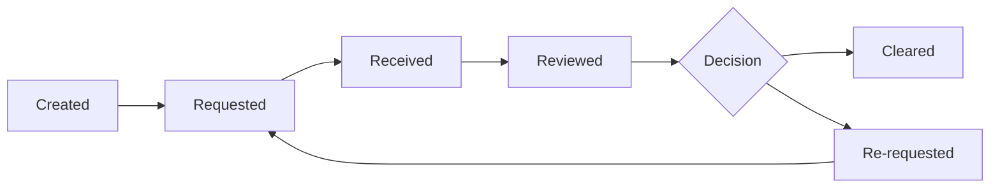

# Condition Management

Conditions are requirements that must be satisfied for loan approval. This guide covers condition creation, tracking, and clearing.

## Condition Types

### Prior-to-Docs (PTD)

Must be cleared before Closing Disclosure:

- Credit conditions
- Income documentation
- Asset verification

### Prior-to-Funding (PTF)

Must be cleared before funding:

- Final verification items
- Insurance confirmation
- Title clearance

### Prior-to-Close (PTC)

Must be cleared before closing:

- Final employment verification
- Rate lock confirmation

## Condition Lifecycle

## Creating Conditions

### From Templates

1. Navigate to loan **Conditions** tab
2. Click **Add Condition**
3. Select from template library
4. Customize if needed
5. Save condition

### Manual Creation

1. Click **Add Condition**
2. Select **Custom**
3. Enter condition details:
   - Title
   - Description
   - Type (PTD/PTF/PTC)
   - Category
   - Due date

### From AUS Findings

Import conditions from DU/LP:

1. View AUS findings
2. Click **Import as Conditions**
3. Select findings to import
4. Review and confirm

## Managing Conditions

### Viewing Conditions

The conditions panel shows:

- Condition status
- Due date
- Assigned documents
- Notes and history

### Requesting Documents

Link conditions to document requests:

1. Open condition
2. Click **Request Document**
3. Select document type
4. Send to borrower

### Linking Documents

Connect uploaded documents to conditions:

1. Open condition
2. Click **Link Document**
3. Select uploaded document
4. Add notes if needed

## Clearing Conditions

### Review Process

1. Document received notification
2. Review linked document
3. Verify requirements met
4. Clear or reject

### Clearing a Condition

1. Open condition detail
2. Click **Clear**
3. Add clearing notes
4. Confirm action

### Rejecting Documents

If documents don't satisfy condition:

1. Click **Reject**
2. Add reason
3. Request updated document

## Waiving Conditions

Some conditions can be waived:

1. Open condition
2. Click **Waive**
3. Enter justification
4. Manager approval (if required)

<Callout type="warning">
Waiving conditions requires appropriate permissions and documentation.
</Callout>

## Condition Categories

- **Income** - Paystubs, W-2s, tax returns
- **Assets** - Bank statements, gift letters
- **Credit** - Explanations, payoffs
- **Property** - Appraisal, insurance
- **Title** - Liens, judgments
- **Other** - Miscellaneous items

## Best Practices

1. Use templates for consistency
2. Set realistic due dates
3. Be specific in descriptions
4. Link documents promptly
5. Add clear notes when clearing

## Related Documentation

- [Underwriting Workflow](/docs/workflows/underwriting-flow)
- [Document Management](/docs/workflows/document-management)
