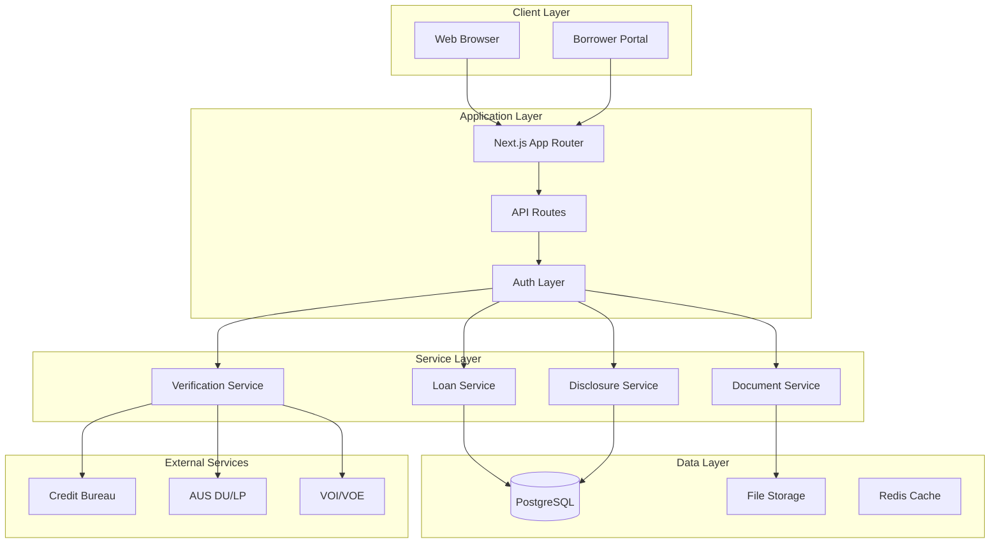

# System Architecture

This document provides a technical overview of JaroLoan's architecture.

## Architecture Overview



## Technology Stack

### Frontend

| Technology | Purpose |
|------------|---------|
| Next.js 15 | React framework with App Router |
| React 19 | UI library |
| TypeScript | Type safety |
| Tailwind CSS | Styling |
| shadcn/ui | Component library |

### Backend

| Technology | Purpose |
|------------|---------|
| Next.js API Routes | REST API endpoints |
| Prisma | Database ORM |
| NextAuth.js | Authentication |
| Zod | Schema validation |

### Database

| Technology | Purpose |
|------------|---------|
| PostgreSQL | Primary database |
| Redis | Caching, sessions |

### Infrastructure

| Service | Purpose |
|---------|---------|
| Vercel | Application hosting |
| AWS S3 | Document storage |
| Supabase | Database hosting |

## Application Structure

### Directory Layout

```
jaroloan/
├── app/                    # Next.js App Router
│   ├── api/               # API routes
│   ├── (dashboard)/       # Dashboard pages
│   └── (portal)/          # Borrower portal
├── components/            # React components
│   ├── ui/               # Base UI components
│   └── los/              # LOS-specific components
├── lib/                   # Shared libraries
│   ├── services/         # Business logic
│   ├── validations/      # Zod schemas
│   └── utils/            # Utilities
└── prisma/               # Database schema
```

### Key Patterns

**Server Components**
- Default for data fetching
- Reduced client bundle
- Direct database access

**Client Components**
- Interactive UI elements
- Form handling
- Real-time updates

**Server Actions**
- Form submissions
- Data mutations
- Automatic revalidation

## Authentication

### NextAuth.js Integration

```typescript
// Simplified auth configuration
export const authOptions: AuthOptions = {
  providers: [
    CredentialsProvider({
      async authorize(credentials) {
        // Validate credentials
        // Return user or null
      }
    })
  ],
  callbacks: {
    async jwt({ token, user }) {
      // Add custom claims
    },
    async session({ session, token }) {
      // Populate session
    }
  }
}
```

### Session Management

- JWT tokens for stateless auth
- Role-based permissions
- Session refresh
- Automatic expiration

## Data Flow

### Request Lifecycle

1. Request received by Next.js
2. Middleware validates session
3. Route handler processes request
4. Service layer executes business logic
5. Database operations via Prisma
6. Response returned to client

### State Management

- React Query for server state
- Zustand for client state
- URL state for navigation

## Database Design

See [Database Schema](/docs/technical/database) for detailed documentation.

### Key Entities

- Loan
- Borrower
- Property
- Document
- Condition
- Disclosure
- User

## API Design

See [API Reference](/docs/technical/api-reference) for detailed documentation.

### Conventions

- RESTful endpoints
- JSON responses
- Error handling
- Pagination

## Security Architecture

### Defense in Depth

1. Network layer (WAF, DDoS protection)
2. Transport layer (TLS 1.3)
3. Application layer (Auth, validation)
4. Data layer (Encryption)

### Data Protection

- AES-256 at rest
- TLS in transit
- Field-level encryption for PII

## Related Documentation

- [API Reference](/docs/technical/api-reference)
- [Database Schema](/docs/technical/database)
- [Security](/docs/compliance/security)
