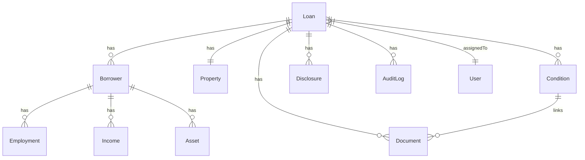

# Database Schema

This document describes the JaroLoan database schema and entity relationships.

## Schema Overview

JaroLoan uses PostgreSQL with Prisma ORM. The schema is defined in `prisma/schema.prisma`.

## Entity Relationship Diagram



## Core Entities

### Loan

Central entity for loan records.

```prisma
model Loan {
  id              String   @id @default(cuid())
  loanNumber      String   @unique
  stage           Stage    @default(APPLICATION)
  loanType        LoanType
  loanAmount      Decimal
  purchasePrice   Decimal?
  interestRate    Decimal?
  term            Int?

  // Relationships
  borrowers       Borrower[]
  property        Property?
  documents       Document[]
  conditions      Condition[]
  disclosures     Disclosure[]

  // Assignment
  loanOfficerId   String?
  processorId     String?
  underwriterId   String?

  // Timestamps
  createdAt       DateTime @default(now())
  updatedAt       DateTime @updatedAt
}
```

### Borrower

Borrower information.

```prisma
model Borrower {
  id            String        @id @default(cuid())
  loanId        String
  type          BorrowerType

  // Personal
  firstName     String
  lastName      String
  email         String?
  phone         String?
  ssn           String?       @encrypted
  dateOfBirth   DateTime?

  // Relationships
  loan          Loan          @relation(...)
  employments   Employment[]
  incomes       Income[]
  assets        Asset[]
}
```

### Property

Property/collateral information.

```prisma
model Property {
  id            String       @id @default(cuid())
  loanId        String       @unique

  // Address
  street        String
  city          String
  state         String
  zipCode       String
  county        String?

  // Details
  propertyType  PropertyType
  occupancy     Occupancy
  yearBuilt     Int?
  squareFeet    Int?

  // Value
  purchasePrice Decimal?
  appraisedValue Decimal?

  loan          Loan         @relation(...)
}
```

### Document

Uploaded documents.

```prisma
model Document {
  id            String        @id @default(cuid())
  loanId        String

  // File info
  filename      String
  type          DocumentType
  mimeType      String
  size          Int
  storageKey    String

  // Classification
  category      String?
  confidence    Float?

  // Status
  status        DocStatus     @default(PENDING)
  uploadedById  String

  // Relationships
  loan          Loan          @relation(...)
  conditions    Condition[]

  createdAt     DateTime      @default(now())
}
```

### Condition

Underwriting conditions.

```prisma
model Condition {
  id            String          @id @default(cuid())
  loanId        String

  // Details
  title         String
  description   String?
  type          ConditionType
  category      ConditionCategory

  // Status
  status        ConditionStatus @default(OPEN)
  dueDate       DateTime?
  clearedAt     DateTime?
  clearedById   String?

  // Relationships
  loan          Loan            @relation(...)
  documents     Document[]

  createdAt     DateTime        @default(now())
}
```

### Disclosure

TRID disclosures.

```prisma
model Disclosure {
  id            String          @id @default(cuid())
  loanId        String

  // Type
  type          DisclosureType
  version       Int             @default(1)

  // Timing
  generatedAt   DateTime
  sentAt        DateTime?
  receivedAt    DateTime?

  // Content
  data          Json
  pdfUrl        String?

  loan          Loan            @relation(...)
}
```

### User

System users.

```prisma
model User {
  id            String   @id @default(cuid())
  email         String   @unique
  passwordHash  String

  // Profile
  firstName     String
  lastName      String
  role          Role

  // Status
  active        Boolean  @default(true)
  lastLoginAt   DateTime?

  createdAt     DateTime @default(now())
}
```

## Enums

### Stage

```prisma
enum Stage {
  LEAD
  APPLICATION
  PROCESSING
  UNDERWRITING
  CONDITIONAL
  CTC
  CLOSING
  FUNDED
  POST_CLOSE
}
```

### ConditionType

```prisma
enum ConditionType {
  PTD    // Prior to Docs
  PTF    // Prior to Funding
  PTC    // Prior to Close
}
```

### Role

```prisma
enum Role {
  LOAN_OFFICER
  PROCESSOR
  UNDERWRITER
  CLOSER
  MANAGER
  ADMIN
}
```

## Indexes

Key indexes for performance:

```prisma
@@index([stage])
@@index([loanOfficerId])
@@index([createdAt])
@@index([loanNumber])
```

## Migrations

### Running Migrations

```bash
npx prisma migrate dev
```

### Creating Migrations

```bash
npx prisma migrate dev --name add_new_field
```

## Related Documentation

- [Architecture](/docs/technical/architecture)
- [API Reference](/docs/technical/api-reference)
