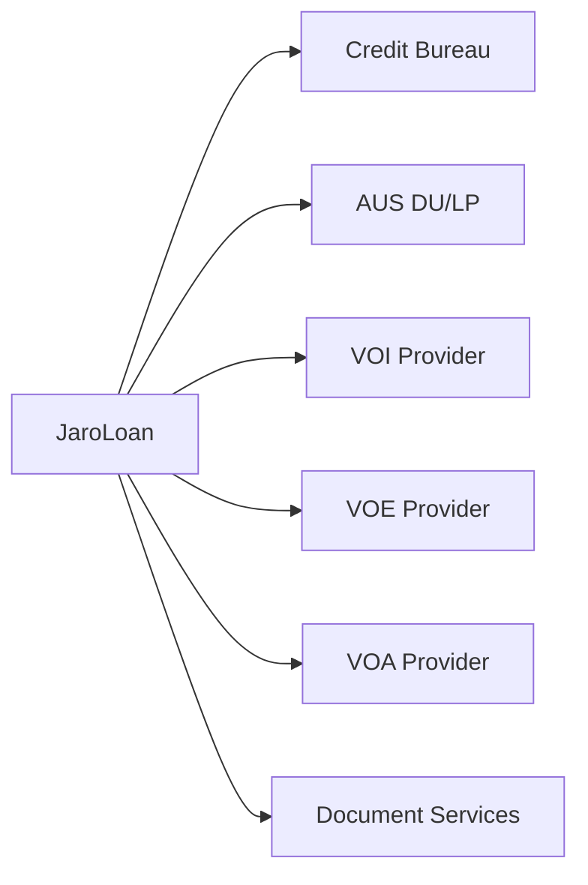

# Integrations

JaroLoan integrates with various external services for credit, verification, and AUS.

## Integration Architecture



## Credit Bureau Integration

### Supported Providers

- Equifax
- Experian
- TransUnion
- Merged credit report vendors

### Configuration

```typescript
// lib/integrations/credit.ts
export const creditConfig = {
  provider: process.env.CREDIT_PROVIDER,
  apiKey: process.env.CREDIT_API_KEY,
  endpoint: process.env.CREDIT_ENDPOINT,
}
```

### API Flow

1. Request credit report
2. Provider authenticates
3. Report returned
4. Data parsed and stored

### Response Handling

```typescript
interface CreditResponse {
  scores: {
    equifax: number
    experian: number
    transunion: number
  }
  tradelines: Tradeline[]
  publicRecords: PublicRecord[]
  inquiries: Inquiry[]
}
```

## AUS Integration

### Desktop Underwriter (DU)

Fannie Mae's automated underwriting system.

**Configuration:**
```typescript
export const duConfig = {
  endpoint: process.env.DU_ENDPOINT,
  sellerId: process.env.DU_SELLER_ID,
  credentials: process.env.DU_CREDENTIALS,
}
```

### Loan Product Advisor (LP)

Freddie Mac's automated underwriting system.

**Configuration:**
```typescript
export const lpConfig = {
  endpoint: process.env.LP_ENDPOINT,
  sellerId: process.env.LP_SELLER_ID,
  credentials: process.env.LP_CREDENTIALS,
}
```

### MISMO Integration

Both DU and LP use MISMO 3.x format:

```xml
<LOAN>
  <LOAN_IDENTIFIERS>
    <LOAN_IDENTIFIER>...</LOAN_IDENTIFIER>
  </LOAN_IDENTIFIERS>
  <TERMS_OF_LOAN>...</TERMS_OF_LOAN>
</LOAN>
```

## Verification Services

### VOI (Income Verification)

Providers:
- The Work Number
- Truework
- Argyle

**Integration Flow:**
1. Order verification
2. Provider contacts employer
3. Results returned
4. Data parsed and displayed

### VOE (Employment Verification)

Providers:
- The Work Number
- Equifax Workforce Solutions
- Direct employer verification

### VOA (Asset Verification)

Providers:
- Plaid
- Finicity
- MX

**OAuth Flow:**
```
1. User initiates connection
2. Redirect to bank login
3. User authenticates
4. Token returned
5. Account data retrieved
```

## Document Services

### OCR Integration

Document classification and data extraction:

```typescript
interface OCRResult {
  documentType: string
  confidence: number
  extractedData: Record<string, any>
}
```

### E-Sign Integration

Electronic signature providers:

- DocuSign
- BetterSign
- Custom solution

## Webhook Configuration

### Receiving Webhooks

Configure endpoint in admin:

1. Go to **Admin > Integrations**
2. Select integration
3. Enter webhook URL
4. Copy signing secret

### Webhook Security

Validate webhook signatures:

```typescript
function verifyWebhook(payload: string, signature: string) {
  const expected = crypto
    .createHmac('sha256', WEBHOOK_SECRET)
    .update(payload)
    .digest('hex')
  return signature === expected
}
```

## Error Handling

### Retry Logic

Transient errors handled with retry:

```typescript
const retryConfig = {
  maxRetries: 3,
  initialDelay: 1000,
  maxDelay: 30000,
  backoffMultiplier: 2,
}
```

### Fallback Handling

When integrations fail:

1. Log error details
2. Notify operations
3. Queue for retry
4. Manual fallback option

## Admin Configuration

### Adding Credentials

1. Navigate to **Admin > Integrations**
2. Select service type
3. Enter credentials
4. Test connection
5. Save configuration

### Testing Integrations

Test endpoints available:

```
POST /api/integrations/test
{
  "type": "credit",
  "provider": "equifax"
}
```

## Related Documentation

- [Architecture](/docs/technical/architecture)
- [API Reference](/docs/technical/api-reference)
- [Admin Guide](/docs/user-guide/admins)
