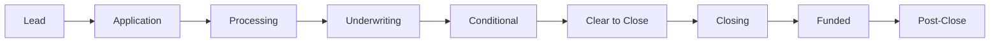

# Loan Lifecycle

Understanding the loan lifecycle is fundamental to using JaroLoan effectively. This guide walks through each stage a loan passes through from initial lead to final funding.

## Lifecycle Overview

## Stage Descriptions

### Lead

Initial contact with a potential borrower. At this stage:

- Basic borrower information is captured
- Initial loan parameters are estimated
- Loan officer begins qualification

**Required to proceed:** Basic contact information, estimated loan amount

### Application

Full loan application is collected:

- Complete 1003 application data
- Initial disclosures (LE) generated
- Intent to Proceed captured
- Initial document collection begins

**Required to proceed:** Complete application, LE sent, intent received

### Processing

Loan file preparation and verification:

- Credit reports pulled
- Verification of income, employment, assets
- Document collection and organization
- Appraisal ordered

**Required to proceed:** All verifications complete, documents collected

### Underwriting

Credit risk analysis and decision:

- Full file review
- AUS submission
- Risk assessment
- Decision: Approve, Suspend, or Deny

**Required to proceed:** Underwriting decision rendered

### Conditional

Condition clearing phase:

- Prior-to-docs conditions created
- Documents requested from borrower
- Conditions reviewed and cleared
- Final approval obtained

**Required to proceed:** All PTD conditions cleared

### Clear to Close (CTC)

Final approval and closing preparation:

- All conditions satisfied
- Final underwriting sign-off
- CD generated and sent
- Closing scheduled

**Required to proceed:** CD sent, 3-day waiting period

### Closing

Loan document signing and funding:

- Final figures confirmed
- Documents signed
- Funds disbursed
- Transaction recorded

**Required to proceed:** All documents signed, funds cleared

### Funded

Loan has been funded:

- Wire sent
- Recording initiated
- Investor delivery prep begins

**Required to proceed:** Recording confirmed

### Post-Close

Final activities:

- Final documents collected
- Investor delivery completed
- File archived

## Stage Transitions

Each stage transition has specific requirements. See [Stage Machine](/docs/technical/architecture) for detailed transition rules.

## SLA Tracking

JaroLoan tracks time-in-stage against SLA targets:

| Stage | Target SLA |
|-------|------------|
| Application | 1 day |
| Processing | 5 days |
| Underwriting | 2 days |
| Conditional | 3 days |
| CTC to Closing | 3 days |

## Next Steps

- [Underwriting Workflow](/docs/workflows/underwriting-flow)
- [Closing Workflow](/docs/workflows/closing-flow)
- [Document Management](/docs/workflows/document-management)
